# Compose + Mavericks 声明式UI教程

## 🎯 学习目标

通过实际项目对比传统View系统与Compose声明式UI，掌握：
1. Compose声明式UI开发范式
2. Mavericks响应式状态管理与Compose集成
3. Material Design 3在Compose中的应用
4. 现代Android架构最佳实践

## 📊 架构对比分析

### 传统架构 (Fragment + Epoxy)
```
Fragment → ViewBinding → Epoxy → RecyclerView
   ↓         ↓           ↓          ↓
命令式UI   XML布局    Adapter    ViewHolder
```

### Compose架构 (声明式)
```
Activity → @Composable → LazyColumn → Item
   ↓          ↓           ↓         ↓
setContent  函数式UI   声明式列表  组合函数
```

## 🏗️ 核心组件详解

### 1. MainActivityCompose - 入口Activity

**关键学习点:**
- 继承`ComponentActivity`而非`AppCompatActivity`
- 使用`setContent{}`设置Compose UI
- `mavericksActivityViewModel()`自动管理ViewModel生命周期

```kotlin
class MainActivityCompose : ComponentActivity() {
    override fun onCreate(savedInstanceState: Bundle?) {
        super.onCreate(savedInstanceState)
        
        setContent {
            // Mavericks集成：自动管理ViewModel
            val viewModel: AppListViewModel = mavericksActivityViewModel()
            
            QQInterceptorTheme {
                Surface(
                    modifier = Modifier.fillMaxSize(),
                    color = MaterialTheme.colorScheme.background
                ) {
                    AppListScreen(viewModel = viewModel)
                }
            }
        }
    }
}
```

**教学重点:**
- `ComponentActivity`是Compose推荐的基类
- `setContent{}`块中的代码在每次重组时执行
- Theme和Surface提供Material Design基础

### 2. AppListScreen - 主屏幕Composable

**关键学习点:**
- `collectAsState()`订阅Mavericks状态变化
- 状态驱动的UI渲染
- 本地状态与业务状态分离

```kotlin
@Composable
fun AppListScreen(viewModel: AppListViewModel) {
    // 状态订阅 - Compose与Mavericks集成核心
    val state by viewModel.collectAsState()
    
    // 本地UI状态
    var selectedApp by remember { mutableStateOf<AppInfo?>(null) }
    var searchQuery by remember { mutableStateOf("") }
    
    Column {
        // 根据状态条件渲染UI
        when {
            state.isLoading -> CircularProgressIndicator()
            state.error != null -> ErrorView(state.error)
            else -> AppList(state.filteredApps)
        }
    }
    
    // 状态驱动的对话框
    selectedApp?.let { app ->
        AppDetailDialog(app) { selectedApp = null }
    }
}
```

**教学重点:**
- `collectAsState()`只在相关状态变化时重组
- `remember`保持本地状态在重组间不丢失
- 条件渲染：when语句决定显示内容

### 3. AppItem - 列表项组件

**传统View vs Compose对比:**

**传统ViewBinding方式:**
```kotlin
// 命令式：逐步修改UI
binding.tvAppName.text = appInfo.appName
binding.ivAppIcon.setImageDrawable(appInfo.icon)
if (appInfo.isSystemApp) {
    binding.tvSystemTag.visibility = View.VISIBLE
} else {
    binding.tvSystemTag.visibility = View.GONE
}
```

**Compose声明式方式:**
```kotlin
@Composable
fun AppItem(appInfo: AppInfo, onClick: () -> Unit) {
    Card(onClick = onClick) {
        Row {
            AppIcon(appInfo.icon)
            Column {
                Text(appInfo.appName)
                // 条件渲染：声明式地描述何时显示
                if (appInfo.isSystemApp) {
                    SystemAppTag()
                }
                SignatureInfo(appInfo)
            }
        }
    }
}
```

**关键差异:**
- **命令式**: 告诉UI"如何"改变
- **声明式**: 描述UI"应该是什么样子"

### 4. 状态管理模式

**Mavericks + Compose状态流:**

```kotlin
// ViewModel中状态更新（不变）
fun updateSearchQuery(query: String) {
    setState { copy(searchQuery = query) }
    // ...过滤逻辑
}

// Compose中状态消费（新方式）
@Composable
fun SearchComponent(viewModel: AppListViewModel) {
    val state by viewModel.collectAsState() // 自动订阅
    
    SearchBar(
        query = state.searchQuery,
        onQueryChange = viewModel::updateSearchQuery
    ) // 状态变化时UI自动重组
}
```

## 🔄 响应式数据流

```mermaid
graph TD
    A[用户交互] --> B[ViewModel更新]
    B --> C[setState修改状态]
    C --> D[collectAsState检测变化]
    D --> E[Compose重组相关UI]
    E --> F[UI反映最新状态]
```



## 🎨 Material Design 3集成

### 主题系统
```kotlin
@Composable
fun QQInterceptorTheme(
    darkTheme: Boolean = isSystemInDarkTheme(),
    content: @Composable () -> Unit
) {
    MaterialTheme(
        colorScheme = if (darkTheme) DarkColorScheme else LightColorScheme,
        typography = Typography,
        content = content
    )
}
```

### 组件使用
```kotlin
// Card - 替代CardView
Card(
    elevation = CardDefaults.cardElevation(2.dp),
    shape = RoundedCornerShape(8.dp)
) { /* 内容 */ }

// SearchBar - 替代SearchView
SearchBar(
    query = query,
    onQueryChange = onQueryChange,
    placeholder = { Text("搜索...") }
) { /* 搜索建议 */ }
```

## 🚀 性能优化要点

### 1. 稳定的Key
```kotlin
LazyColumn {
    items(
        items = apps,
        key = { it.packageName } // 稳定key优化重组
    ) { app ->
        AppItem(app)
    }
}
```

### 2. 状态提升
```kotlin
// ❌ 错误：每个item都订阅整个状态
@Composable
fun AppItem(viewModel: AppListViewModel) {
    val state by viewModel.collectAsState() // 过度订阅
}

// ✅ 正确：只传递必要数据
@Composable
fun AppItem(appInfo: AppInfo, onClick: () -> Unit) {
    // 只在appInfo变化时重组
}
```

### 3. remember使用
```kotlin
@Composable
fun AppItem(appInfo: AppInfo) {
    // 记住计算结果，避免重复计算
    val dateFormat = remember {
        SimpleDateFormat("yyyy-MM-dd", Locale.getDefault())
    }
}
```

## 📚 核心概念对比

| 概念 | 传统View | Compose |
|------|----------|---------|
| UI更新 | 命令式修改 | 声明式描述 |
| 状态管理 | 手动同步 | 自动重组 |
| 布局 | XML文件 | Kotlin函数 |
| 列表渲染 | RecyclerView+Adapter | LazyColumn |
| 主题 | styles.xml | MaterialTheme |
| 动画 | Animator | Compose Animation |

## 🎯 学习路径建议

### 初级阶段
1. 理解声明式UI概念
2. 掌握基础Composable函数
3. 学会状态管理（remember, mutableStateOf）

### 中级阶段  
1. 深入状态提升模式
2. 掌握LazyColumn等复杂组件
3. 理解重组机制和性能优化

### 高级阶段
1. 自定义组件开发
2. 复杂动画和手势
3. 与其他架构框架集成

## 🔧 调试技巧

### 1. Layout Inspector
使用Android Studio的Layout Inspector查看Compose层次结构

### 2. Recomposition Highlighting
启用重组高亮看到哪些部分在重组

### 3. 日志调试
```kotlin
@Composable
fun DebugComposable() {
    println("重组了！")
    // 组件内容
}
```

## 💡 最佳实践总结

1. **单一数据源**: ViewModel是状态的唯一来源
2. **状态下沉**: 状态尽可能靠近使用它的组件
3. **组合优于继承**: 通过组合小组件构建复杂UI
4. **不可变数据**: 使用不可变对象保证状态一致性
5. **测试友好**: Compose UI测试比View测试更简单

## 🚀 下一步学习方向

1. **Navigation Compose**: 学习Compose导航
2. **Animation API**: 掌握Compose动画系统  
3. **Custom Layouts**: 创建自定义布局组件
4. **Testing**: Compose UI测试框架
5. **Performance**: 深入性能分析和优化

---

**🎊 恭喜！** 你已经完成了从传统View到Compose声明式UI的学习之旅。这个项目展示了现代Android开发的最佳实践，为你的技能提升打下了坚实基础！